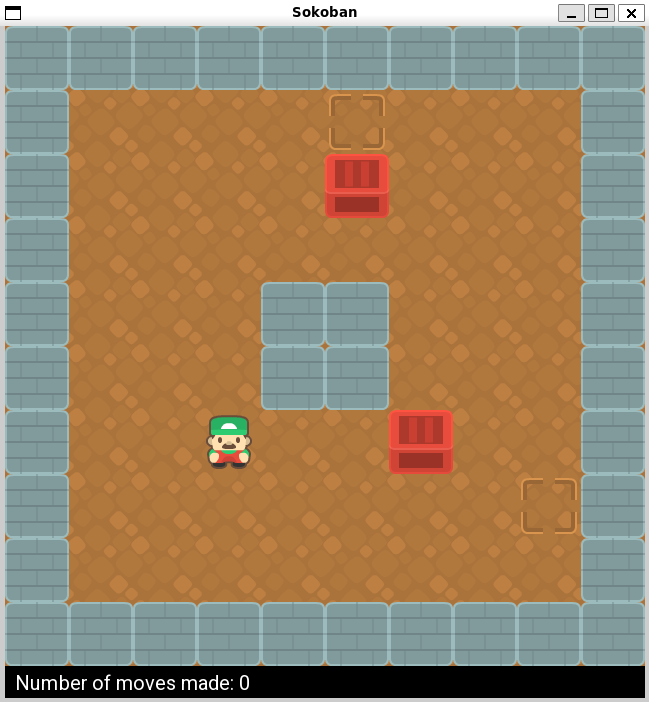

# Sokoban Puzzle Game

A Sokoban puzzle game written in C++ with SFML. The player pushes crates onto the storage squares, and the level is won when every storage square holds a crate. The project includes six levels and supports undo and redo. It was written for a UMass Lowell computer science course (Section 302).



## Features

- **Level files:** levels are plain text `.lvl` files loaded at start-up. The window resizes to fit the level.
- **Movement and pushing:** the player moves one tile at a time and pushes one crate at a time.
- **Collision detection:** the player cannot walk through walls or leave the grid, and a crate cannot be pushed into a wall, another crate or the edge of the grid.
- **Undo and redo:** every move saves the board state on a stack, so moves can be reversed and replayed.
- **Win detection:** the game checks after each move whether every storage square holds a crate. It then plays a victory sound and closes the window after two seconds.
- **Facing sprite:** the player sprite turns to face the direction of the last move.

## Controls

| Key | Action |
| --- | --- |
| Arrow keys | Move and push crates |
| `Z` | Undo the last move |
| `Y` | Redo an undone move |

## Build and Run

You need `g++` with C++17, [SFML](https://www.sfml-dev.org/) (graphics, window, system and audio), and the Boost unit test framework for the `test` target.

```
cd Sokoban
make
./Sokoban level1.lvl
```

Run it from the `Sokoban` folder, because the program loads its images and sounds with relative paths. Pass any level file as the argument, for example `./Sokoban level3.lvl`.

## Levels

The folder contains `level1.lvl` to `level6.lvl`, plus small levels for testing (`autowin`, `pushup`, `pushdown`, `pushleft`, `pushright`, `swapoff` and `walkover`). A level file is a grid of characters:

| Character | Meaning |
| --- | --- |
| `#` | Wall |
| `.` | Floor |
| `A` | Crate |
| `a` | Storage square |
| `@` | Player start |

You can make your own level by writing a grid in this format. Rows shorter than the longest row are padded with floor.

## Project Structure

| File | Purpose |
| --- | --- |
| `Sokoban/Sokoban.hpp`, `Sokoban.cpp` | The `SB::Sokoban` class: level loading, movement, crate pushing, win check, undo and redo. |
| `Sokoban/main.cpp` | Opens the window, draws the grid and handles key presses. |
| `Sokoban/test.cpp` | A small test program for movement and undo/redo. |
| `Sokoban/images`, `sounds`, `fonts` | Game assets. |
| `Sokoban/Readme-ps3.md` | The original course submission notes. |

## Credits

- Sprites: [Kenney Sokoban Pack](https://kenney.nl/assets/sokoban) (CC0)
- Victory sound: [Mixkit](https://mixkit.co/free-sound-effects/win/)
- [SFML](https://www.sfml-dev.org/) documentation and course lectures

## Author

Dhanvika Nakka
